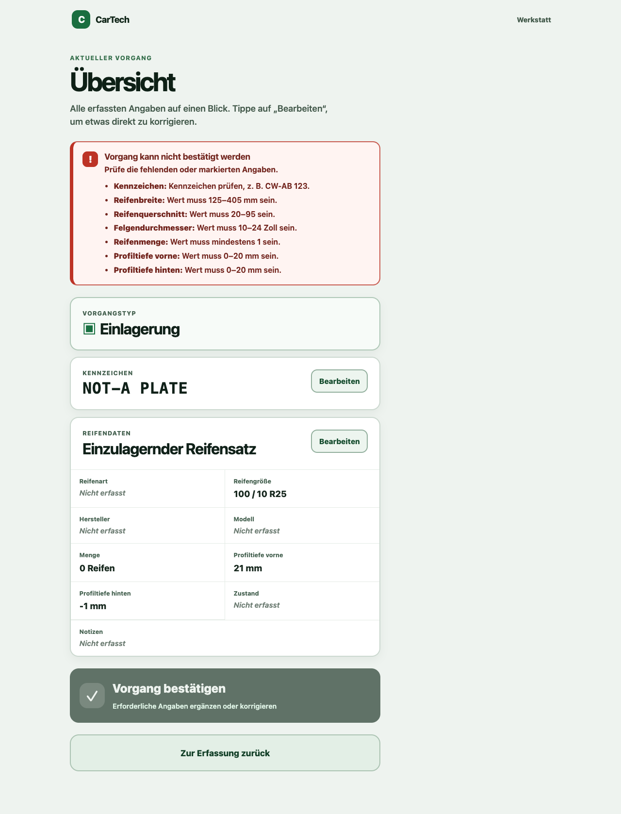

# Benutzerablauf

## Ziel

Der Mechaniker soll möglichst wenig tippen oder klicken.

```text
Mechaniker wählt ein Protokoll
→ Mechaniker spricht
→ KI extrahiert
→ Mechaniker bestätigt und sendet ab
→ Büro erhält ein strukturiertes Protokoll per E-Mail
→ Büro prüft, korrigiert und speichert den Vorgang in WERBAS
```

## Hauptrollen

### Mechaniker

Aufgaben:

- neue Fahrzeug- oder Serviceerfassung starten
- Informationen einsprechen
- KI-Ergebnis kurz kontrollieren
- fehlerhafte oder fehlende Daten korrigieren
- Datensatz bestätigen

Der Mechaniker erstellt oder ordnet keine Kunden zu.

### Büro

Aufgaben:

- offene Vorgänge prüfen
- erkannte Daten korrigieren
- fehlende Kundendaten ergänzen
- Kunden zuordnen oder neu anlegen
- Vorgang finalisieren
- strukturierte E-Mails in WERBAS übernehmen und dort bearbeiten

## Statusablauf

```text
Neue Erfassung: draft
Nach Extraktion: mechanic_review
Nach erfolgreichem E-Mail-Versand: email_sent
Bei Abbruch: rejected
```

Der Ablaufstatus wird im MVP nicht zentral gespeichert und endet nach erfolgreichem Versand. Unsicherheiten und Plausibilitätsfehler werden separat durch Feldstatus und `review_required` gekennzeichnet und als Prüfhinweis in der E-Mail ausgegeben. Korrekturen nimmt das Büro anschließend in WERBAS vor.

## Flow 1: Neue Erfassung

### Schritt 1 – Protokoll wählen

Der Mechaniker öffnet die neue Erfassung und wählt eines der beiden Werkstattprotokolle:

```text
Reifenwechsel
Reifeneinlagerung
```

Die Auswahl setzt den `service_type` auf `tire_change` beziehungsweise `tire_storage` und erzeugt einen Vorgang mit dem Status `draft`. Der gewählte Protokolltyp bleibt für die Aufnahme maßgeblich; die KI darf ihn nicht aufgrund einer missverstandenen Formulierung ändern.

### Schritt 2 – Spracheingabe

Beispiel für ein Reifenwechselprotokoll:

> „CW AB 123, 73.400 Kilometer, vier Michelin Alpin 6 Winterreifen, 205 55 16, vorne sechs Millimeter, hinten fünf.“

Der Mechaniker muss keine feste Reihenfolge einhalten. Er startet die Erfassung über das Kennzeichen; ein Kundenobjekt wird dabei nicht angelegt.

### Schritt 3 – Verarbeitung

Das System:

1. nimmt Audio auf,
2. führt Speech-to-Text durch,
3. extrahiert einen strukturierten Entwurf,
4. validiert die Daten und
5. markiert Unsicherheiten.

Währenddessen zeigt die App:

```text
Daten werden verarbeitet …
```

Nach erfolgreicher Extraktion erhält der Vorgang den Status `mechanic_review`.

### Schritt 4 – Mechanikerprüfung

Die wichtigsten Werte werden kompakt angezeigt:

```text
CW-AB 123
73.400 km

Reifenwechsel

Winterreifen
Michelin Alpin 6
205/55 R16
4 Stück

Profil
Vorne 6 mm
Hinten 5 mm
```

Unsichere Informationen werden deutlich markiert:

```text
Reifenmodell: Alpin 6 [unsicher]
```

### Schritt 5 – Fehlende Informationen

Fehlende Pflichtinformationen werden hervorgehoben:

```text
Kennzeichen fehlt
```

Das System soll eine kurze ergänzende Spracheingabe erlauben:

> „Kennzeichen CW AB 123.“

Danach wird nur das betroffene Feld aktualisiert.

### Schritt 6 – Mechanikerbestätigung und Absenden

Die primäre Aktion lautet:

```text
Bestätigen und absenden
```

Nach dem Absenden speichert das System den bestätigten, validierten Entwurf zunächst sicher in der Versand-Outbox und erzeugt daraus die strukturierte E-Mail an das Büro. Erst wenn der Mailserver die Nachricht erfolgreich angenommen hat, erhält der Vorgang den Status `email_sent`. Der Mechaniker ist dann fertig.

Die E-Mail enthält das vollständige strukturierte Protokoll, mindestens:

- Protokolltyp,
- Kennzeichen und erfasste Fahrzeug-, Reifen- und Servicedaten,
- Absendezeitpunkt und
- klar ausgewiesene fehlende, unsichere oder unplausible Angaben.

Die E-Mail dient dem Büro als Vorlage für die manuelle Übernahme nach WERBAS. Schlägt der Versand fehl, zeigt die Web-App den Status `email_failed`, eine verständliche Fehlermeldung und eine Wiederholen-Aktion. Der bestätigte Datensatz bleibt serverseitig in der Versand-Outbox erhalten; `POST /api/v1/registrations/{id}/retry` versendet genau diese gespeicherte Fassung erneut. Eine zentrale Büro-Inbox oder fachliche CarTech-Speicherung ist weiterhin nicht Teil des MVP.

## Flow 2: Büroprüfung in WERBAS

Das Büro erhält die strukturierte E-Mail und legt oder öffnet anschließend den passenden Vorgang in WERBAS. Eine Büro-Inbox in der CarTech-Web-App ist nicht Teil des MVP.

Beispiel für den strukturierten Text der E-Mail:

```text
Reifenwechsel · abgesendet am 19.08.2026, 10:42
Kennzeichen: CW-AB 123
Kilometerstand: 73.400 km
Montierte Räder: Winterreifen, Michelin Alpin 6, 205/55 R16, 4 Stück
Profil: vorne 6 mm, hinten 5 mm

Prüfhinweise
- Reifenmodell: unsicher
```

Das Büro übernimmt die Werte in WERBAS. Für die Prüfung stehen in der E-Mail zur Verfügung:

- klar markierte fehlende, unsichere und unplausible Felder
- die strukturierten, vom Mechaniker bestätigten Werte
- Protokolltyp, Kennzeichen und Absendezeitpunkt

Das Büro kann Werte in WERBAS korrigieren, den Kunden zuordnen oder neu anlegen und zusätzliche Kundendaten ergänzen. Die Prüfhinweise aus der E-Mail werden dabei abgearbeitet; die verbindliche Dokumentation entsteht in WERBAS.

Eine zentrale Speicherung samt Büro-Inbox mit den Status **Neu**, **Prüfen** und **Erledigt** kann später als Erweiterung ergänzt werden.

## Flow 3: Fehlerhafte Erkennung

Gesprochen:

> „Continental WinterContact“

Fehlerhaft erkannt:

```text
Continental Winter Count
```

Der Mechaniker kann das Feld antippen und korrigieren oder per Sprache berichtigen:

> „Reifenmodell WinterContact.“

Das System aktualisiert nur das betreffende Feld.

## Flow 4: Unsichere oder nicht verstandene Sprache

Bei unsicheren Angaben darf keine automatische Ergänzung erfolgen. Das Feld wird als unsicher markiert und der Vorgang erhält `review_required: true`; der Mechaniker kann fortfahren, wenn das Feld nicht erforderlich ist.

Wenn Speech-to-Text nicht zuverlässig gelingt, zeigt die App:

```text
Spracheingabe konnte nicht zuverlässig erkannt werden.
```

Mögliche Aktionen:

- erneut aufnehmen
- Transkript anzeigen und bearbeiten

Es werden keine geratenen Daten übernommen.

## Flow 5: Reifenwechselprotokoll

Beim Reifenwechsel dokumentiert das Protokoll getrennt, was montiert und was demontiert wurde.

> „Wechsel auf Winterreifen. Abgenommen werden vier Michelin Sommerreifen 225 45 17.“

Das System legt mehrere Reifensätze mit klarer Rolle an:

```text
installed: Winterreifen
removed: Michelin Sommerreifen, 225/45 R17, vier Stück
```

Die erwähnten Sommerreifen dürfen nicht als montierter Satz gespeichert werden. Sollen sie eingelagert werden, wird zusätzlich ein Reifeneinlagerungsprotokoll angelegt.

Für den Wechsel führt die Ansicht durch diese Bereiche:

1. Kunde, Datum, Fahrzeug, EZ, Kennzeichen, Vmax, Kilometerstand und Antriebsart E/Hybrid
2. RäWe, Wuchten Stahl/Alu, maschinelle/manuelle Radwäsche, WHM-Modus sowie nächster KD und Ölservice
3. Luftdruck-Mittelwerte VA/HA, Felgenschloss, gleiche/verschiedene Radschrauben und HU-Fälligkeit
4. Winter- und Sommerräder getrennt mit Profiltiefe, DOT, Größe, LI, VI, Hersteller und Profilbezeichnung
5. Felgen- und Reifensichtprüfung je Satz mit i.O./n.i.O. und Position
6. Fahrwerks- und Bremsensichtprüfung; bei n.i.O. die Bremsscheibendicke
7. Radnabe gereinigt, RDKS, Limiter samt Aufkleber, Drehmoment, Kundenunterschrift und WhatsApp-Freigabe

Der Kunde wird über das Fahrzeug zugeordnet. Fehlt die Zuordnung noch, ergänzt das Büro sie vor dem Abschluss des Protokolls.

Beispiel für die komprimierte Prüfansicht:

```text
Reifenwechsel · CW-AB 123 · EZ 03/2024 · Vmax 180 km/h
E-Antrieb · 73.400 km · RäWe

Winterräder (montiert): 205/55 R16 91H · Continental WinterContact · DOT 2524
Profil: VA 6,5 mm · HA 6,0 mm
Felgen: i.O. · Reifen: i.O.

Sommerräder (demontiert): 205/55 R16 91H · Michelin Primacy 4 · DOT 1423
Profil: VA 4,5 mm · HA 4,0 mm
Felge hinten rechts: n.i.O. – Kratzer

Luftdruck: VA 2,4 bar · HA 2,3 bar
Radnabe gereinigt: Ja · RDKS: aktiv, angelernt · Drehmoment: 120 Nm
Fahrwerk: i.O. · Bremse: n.i.O. · Scheibe vorne rechts: 19,5 mm
Limiter: gesetzt · Aufkleber: Ja · WhatsApp: Ja
Kundenunterschrift: [erfasst]
```

## Flow 6: Reifeneinlagerungsprotokoll

Für eine Einlagerung wählt der Mechaniker beim Start `Reifeneinlagerung`. Das Protokoll enthält ausschließlich die einzulagernden Reifensätze; es beschreibt keinen Reifenwechsel.

Das Protokoll führt den Mechaniker durch diese Bereiche:

1. Kunde, Datum, Fahrzeug und Kennzeichen
2. Felgengröße, Felgenausführung (Alu/Stahl/Original), Felgenhersteller und Felgentyp
3. jeden einzelnen Reifen mit Hersteller, Profil, Profiltiefe, DOT-Nummer, Gebrauchsspuren und Beschädigungen
4. Anmerkungen, Mechaniker und Kundenunterschrift

Der Kunde wird über das Fahrzeug zugeordnet. Ist der Kunde noch nicht hinterlegt, bleibt die Zuordnung bis zur Büroprüfung offen; das Büro ergänzt oder ordnet ihn vor dem Abschluss des Protokolls zu.

Beispiel für die Reifenerfassung:

> „CW AB 123. Vier Michelin Sommerreifen auf 17-Zoll-Alufelgen von Dezent, Typ TZ, zur Einlagerung. Vorne links Profil sechs Komma fünf, DOT 2324, Gebrauchsspuren ja, keine Beschädigung.“

Das Ergebnis wird eindeutig als Einlagerung angezeigt:

```text
Reifeneinlagerung
Kunde: [wird über Fahrzeug zugeordnet]
Datum: 19.08.2026
Fahrzeug: CW-AB 123
Felgen: 17 Zoll, Alu, Dezent Typ TZ

Vorne links
Michelin, Profil 6,5 mm, DOT 2324
Gebrauchsspuren: Ja
Beschädigungen: Nein

Anmerkungen: [optional]
Mechaniker: [angemeldeter Benutzer]
Kundenunterschrift: [erfasst]
```

Die Werte werden für alle Reifen einzeln erfasst. Fehlende technische Angaben werden deutlich markiert und dürfen nicht ergänzt werden. Ein eventuell stattfindender Reifenwechsel wird separat über ein Reifenwechselprotokoll dokumentiert.

## UI-Prinzipien

### Mechanikeransicht

Priorität:

```text
Sprechen > Tippen
```

- große Buttons
- wenige Felder gleichzeitig
- keine langen Formulare
- möglichst keine Dropdown-Ketten
- wichtigste Aktion immer sichtbar
- Fehler direkt und verständlich anzeigen

### Phase-3-Beispiele

Die folgenden Screenshots zeigen die beiden zentralen Zustände der manuellen
Einlagerungserfassung. Sie verwenden ausschließlich anonymisierte Testdaten.

#### Fehlerzustand

Bei fehlenden oder unplausiblen Angaben fasst die Übersicht alle Prüfhinweise
zusammen, markiert die Bestätigung als nicht verfügbar und führt zur Korrektur
über die jeweilige Bearbeiten-Aktion.



#### Erfolgreiche Bestätigung

Nach der Korrektur bestätigt die Mechanikeransicht den Vorgang lokal. Eine
Backend-Übermittlung ist in Phase 3 noch nicht Teil dieses Schritts.


### Büroansicht

Priorität:

```text
Kontrolle > Geschwindigkeit
```

- vollständige Übersicht
- schnelle Korrekturen
- sichtbare Unsicherheiten
- verfügbares Originaltranskript

## Zielwerte für den MVP

Ein normaler Vorgang soll idealerweise nur diese Mechanikerinteraktionen benötigen:

```text
1× Protokoll wählen
1× sprechen
1× bestätigen
```

Zusätzliche Interaktion ist nur bei fehlenden oder falsch erkannten Daten vorgesehen.
